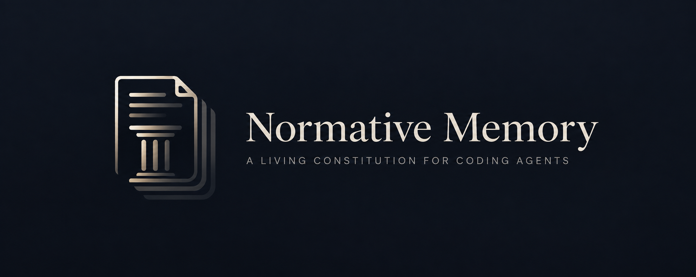

# normative-memory

> Agents lose context. The right way to work should not disappear with it.

A lightweight, versioned operating constitution for coding agents.

Normative memory does not try to remember everything that happened. It preserves only the rules that must stay true after the task ends, the session is compacted, or a new context window begins.

## The problem

A coding agent runs tasks, uses tools, moves across repositories and makes local decisions all day — and gets restarted or compacted the moment its context window runs out. That is the concrete part of *Agentic AI* that matters here: the work is long, the memory is not.

The natural reflex is to write a summary or a handoff. But a summary stores **what happened**: what was done, which file changed, what the ticket number was, what the database looked like that afternoon. By the next session half of it is already false, and the agent either repeats it as if it were true or ignores all of it. Either way the lesson is lost.

And the lesson is almost never the event. It is the **mechanism**: *a zero result needs a positive control*, *never invent a process you have not verified*, *writing to production has an owner*. That stays true tomorrow, in the next repository, in the next context window.

## The idea

Separate the two memories, and version only the one that has to survive.

| where | what it holds | for how long |
|---|---|---|
| **`IMPERATIVES.md`** | the rule, timeless — no ticket, no date, no measurement | as long as it is true |
| **The issue** | why the rule was proposed: the incident, the context, the argument against it | forever, as history |
| **The commit** | the human decision to adopt, change or remove it | forever, in git |

The file stays small on purpose, because it is pasted whole at the start of every session. The context that explains each rule is not lost — it lives in the issue that produced it, one link away, without occupying the window.

The effect is that the next session **neither starts from zero nor starts contaminated**: it starts with what has already been ratified, and with nothing else.

## Categorical and hypothetical

The grammar comes from Kant, and the appropriation is openly practical. A **categorical imperative** holds unconditionally; a **hypothetical imperative** holds when a condition appears. Kant used the distinction to talk about morality — here it is used because it describes precisely the only two shapes an operating rule can take.

That solves a real drafting problem: almost every badly written rule is a hypothetical one disguised as a categorical, too broad because its condition was left implicit. *"Never merge"* is brittle; *"never merge outside the integration branch"* is usable. Keeping the two sections apart forces the question **"is this always, or is this when?"** every time a rule goes in.

## Who can do what

The agent **proposes and maintains**. When it notices a candidate permanent rule, it first tries to knock it down — recurrence, generalisation, duplication, scope, verifiability and the strongest argument against — searches for an equivalent in the file and in open and closed issues, and only then opens the issue. Until the candidate is implemented it belongs to the agent: it edits, narrows the scope, closes, reopens. You never have to write the issue by hand.

Only **you ratify**. No candidate changes `IMPERATIVES.md` without explicit approval:

```
Implement issue #42.
```

"Looks good" is not approval. And when **you** are the one stating the rule — *"add this to the imperatives"* — the instruction is itself the approval: the agent opens the issue for the record and implements it right away, without asking twice.

Once implemented, the issue becomes history and is not rewritten.

## One instance per project

This repository is a generic template. Every project gets its own **private** instance, and one project's rules never enter another's repository — before proposing any rule, confirm you are in the right instance.

A single `IMPERATIVES.md` per instance can mix principles, organisational context, authorities, access, processes, technical procedures and communication rules. When different products of the same company need different rules, that becomes a **hypothetical** imperative in the same file. Split into several files only when the single file causes a concrete problem — not before.

## Getting started

```
gh repo create <project>-normative-memory --template <owner>/normative-memory --private
gh label create imperative --color 5319E7
gh label create add        --color 0E8A16
gh label create modify     --color FBCA04
gh label create remove     --color D93F0B
git config --local user.name  "<your name>"
git config --local user.email "<your email>"
```

Labels are **not copied** with the template — creating them is the first step after instantiating. Normative proposal issues use `imperative` plus exactly one of `add`, `modify`, `remove`. The issue's state is already the status: open is a candidate, closed by the commit is implemented, `not planned` is rejected, `duplicate` is duplicated. Optional evidence PRs use a separate `logs` label after that workflow is explicitly adopted; they are not normative proposals.

After that, at the start of every session, **copy and paste the contents of `IMPERATIVES.md`** into the agent. The file is meant to be pasted, not attached: what is not in the text does not exist in the session.

## Optional usage observability

An opt-in `usage.sh` records declared rule relevance in `usage.toon` and publishes prompt batches through session PRs for manual merge. Run `sh usage.sh --help` for setup and commands. No collection or hook is enabled automatically.

## What remains separate

Normative changes still use **one** approved commit straight to the default branch, touching only `IMPERATIVES.md` and closing the issue with `Closes #<number>`. The script and evidence PRs are separate; adopting the permanent instruction requires its own approval. There is no automatic rule removal or compaction.

The constraint remains readability: the rules fit at the top of a context window, while operational evidence stays outside the imperative file. An event never acquires normative force merely because its PR was merged.
